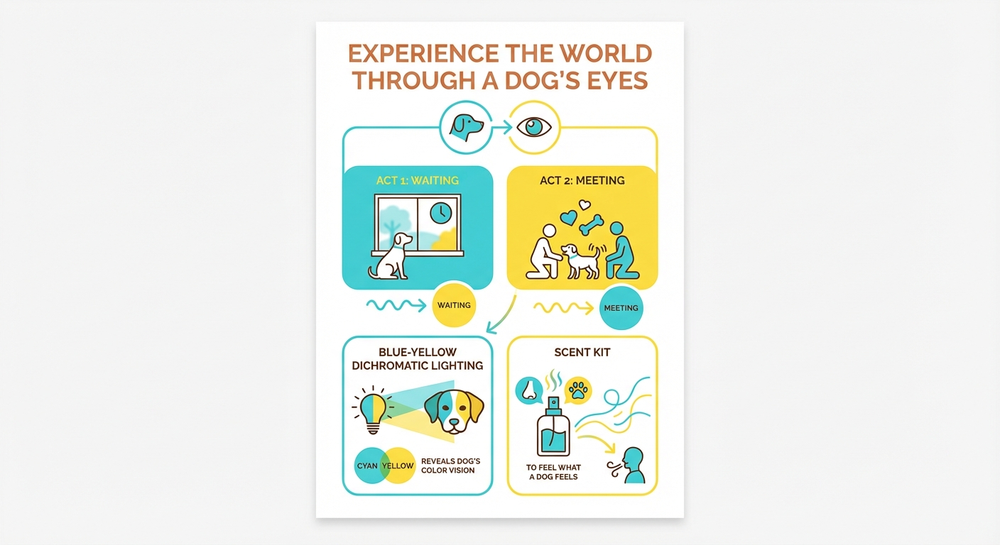
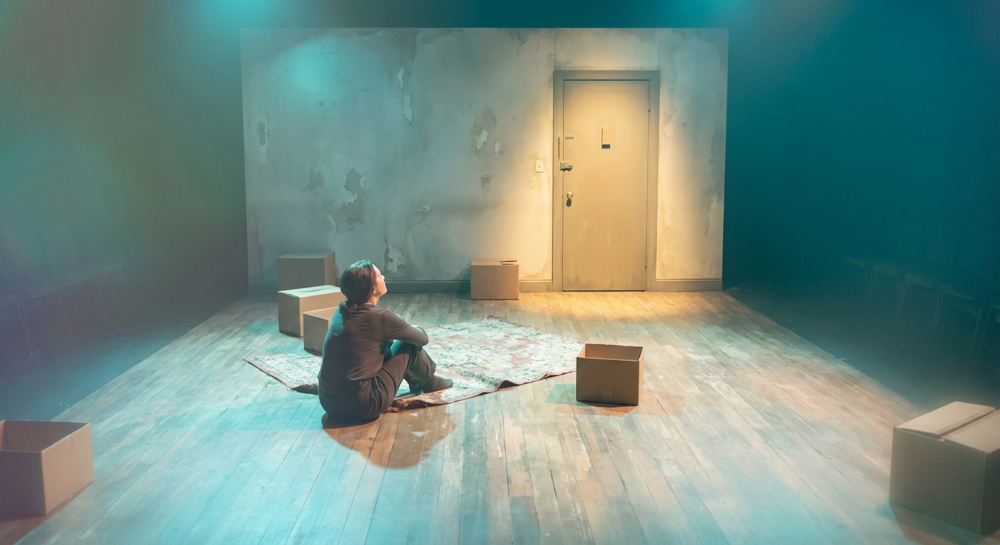
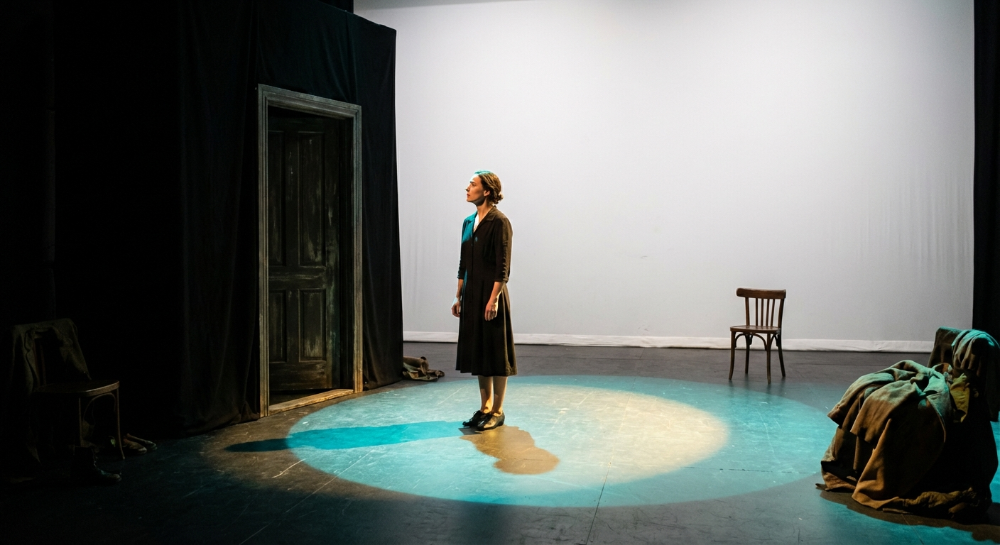
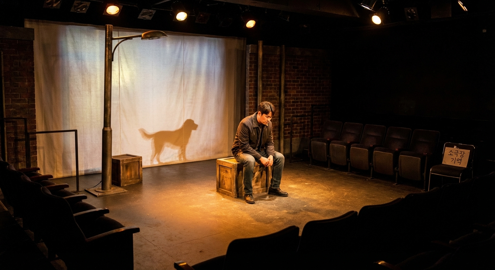

<!--
출력 형식: MS Word (.docx)
- 마크다운으로 초안 작성 후 반드시 아래 명령으로 Word 변환:
  python gateway/tools/generate_docx.py \
    --input output/나는너의오늘이었다/proposal-client-나는너의오늘이었다.md \
    --output output/나는너의오늘이었다/proposal-client-나는너의오늘이었다.docx \
    --image-base output/나는너의오늘이었다/images
- 이미지는 docx 내부에 직접 삽입됨 (외부 링크 금지)
- md 파일과 docx 파일 모두 저장
-->

# 뮤지컬 《나는 너의 오늘이었다》 공연 안내

> 창작 시점 전환 뮤지컬 | 6주 48회 | 소극장 150석

---

## 이 공연은 어떤 공연인가요?

오늘 하루, 당신의 반려견은 무슨 생각을 했을까요.

뮤지컬 《나는 너의 오늘이었다》는 반려견 '오늘이'의 눈으로 본 세상과, 같은 하루를 살아가는 반려인의 내면을 번갈아 그려내는 감성 창작 뮤지컬입니다. 관객은 반려견의 색각으로 물드는 특수 조명 속에서 오늘이가 느끼는 기다림과 설렘을 온몸으로 경험하고, 피날레에서 두 존재가 하나의 진실로 만나는 순간 "우리는 서로의 오늘이었다"는 벅찬 감동을 함께 맞이하게 됩니다.

---

## 이런 분들께 추천합니다

- 매일 문 앞에서 기다리는 반려견을 떠올리며 가슴 한켠이 따뜻해지는 반려인
- 반려견과 함께 나눈 소소하지만 특별한 일상의 감정을 무대 위에서 되새기고 싶은 분
- 배우의 신체 연기와 라이브 피아노·첼로 앙상블이 어우러진 깊이 있는 소극장 공연을 찾으시는 분

---

## 관람 포인트

### 반려견의 눈으로 보는 세계 — 색각 몰입 조명

1막 전체가 개의 이색성 색각에 기반한 청·황 스펙트럼 특수 조명으로 펼쳐집니다. 반려견 오늘이가 바라보는 집과 세상이 무대 위에 그대로 재현되어, 관객은 자신의 반려견이 매일 바라보는 풍경 속으로 걸어 들어가게 됩니다.

### 향기로 완성되는 기억 — 다감각 체험 공연

입장 시 제공되는 향기 연출 키트를 통해 후각까지 공연에 참여합니다. 반려견이 맡는 '집의 냄새'와 '주인의 냄새'를 모티프로 한 향기가 무대 위 장면과 함께 피어오르며, 오늘이의 기억 속으로 더 깊이 들어가는 특별한 경험을 선사합니다.

### 두 존재가 하나로 만나는 피날레 듀엣

1막의 오늘이와 2막의 반려인이 마침내 한 무대에 서는 피날레 듀엣 '나는 너의 오늘이었다'. 홍길동·김영희 두 배우의 바리톤과 소프라노가 겹치는 순간, 공연 내내 쌓아온 기다림과 그리움이 하나의 감동으로 터져 나옵니다.

---

## 주요 장면

### 오늘이의 아침 — 주인 출근 후 텅 빈 집, 문을 바라보는 기다림

주인이 나간 뒤 고요해진 집. 오늘이는 문을 향해 앉아 기다림을 시작합니다. 반려견의 색각 조명 아래 펼쳐지는 첫 장면은, 매일 우리가 집을 나서던 그 순간을 오늘이의 시선으로 다시 바라보게 합니다.

---

### 문이 열릴 때까지 — 원형 스팟라이트 아래 클라이맥스 기다림

1막의 감정이 정점에 이르는 장면. 원형 스팟라이트 아래 홀로 선 오늘이가 부르는 클라이맥스 넘버 '문이 열릴 때까지'는 기다림이 얼마나 간절하고 아름다운 감정인지를 온전히 전달합니다.

---

### 반려인의 하루 — 도시 속 반려견을 그리워하는 내면 장면

2막이 시작되며 시점이 전환됩니다. 도시 속 일상을 살아가면서도 마음 한쪽에는 늘 오늘이를 품고 있는 반려인의 내면이 무대 위에 펼쳐집니다. 같은 하루가 두 존재에게 얼마나 다르게, 그리고 얼마나 닮게 흐르는지를 느끼게 됩니다.

---

### 나는 너의 오늘이었다 — 두 배우의 감동 피날레 듀엣

마침내 두 시점이 하나로 수렴되는 피날레. "우리는 서로의 오늘이었다"라는 한 마디가 울려 퍼지는 순간, 무대와 객석이 함께 숨을 멈춥니다. 공연장을 나서면 가장 먼저 집에서 기다리는 반려견의 얼굴이 떠오를 것입니다.

---

## 공연 정보

| 항목 | 내용 |
|------|------|
| 작품명 | 뮤지컬 《나는 너의 오늘이었다》 |
| 부제 | 오늘이의 하루, 당신이 모르는 이야기 |
| 장르 | 창작 시점 전환 뮤지컬 |
| 공연 기간 | 6주 (48회) |
| 공연장 | 소극장 (150석) |
| 러닝 타임 | 80분 (인터미션 10분 포함) |
| 관람 연령 | 전 연령 (성인 반려인 권장) |
| 티켓 가격 | 50,000원 (R석 기준) |

---

## 예매 안내

- **예매처**: 인터파크 티켓 / YES24 공연
- **단체 관람 문의**: 극단 기획실 (10인 이상 단체 할인 별도 문의)

---

*극단 기획실 | 뮤지컬 《나는 너의 오늘이었다》 공연팀*
