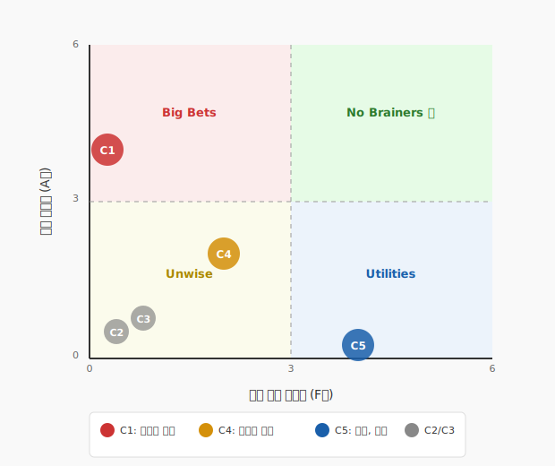

# 핵심 공연 컨셉 선정

**작성자**: 김지은 (라이터) | 집계: 박준혁 (애널리스트) | 작성일: 2026-03-09

---

## 1. 투표 결과

| 컨셉 ID | 컨셉명 | 관객 매력도 A (합계/6) | 실현 가능성 F (합계/6) | A+F 합계 |
|--------|------|:---:|:---:|:---:|
| C1 | 《감각의 유대》 반려견 시점 몰입형 | **4** | 0 | **4** |
| C2 | 《열다섯 해의 이름》 애도의 서사 | 0 | 0 | 0 |
| C3 | 《보호자》 역할 반전 서사 | 0 | 0 | 0 |
| C4 | 《오늘의 사연》 낭독 뮤지컬 시리즈 | **2** | **2** | **4** |
| C5 | 《오늘, 산책》 일상 스케치 | 0 | **4** | **4** |

**투표 상세**

| 에이전트 | C1-A | C2-A | C3-A | C4-A | C5-A | C1-F | C2-F | C3-F | C4-F | C5-F |
|---------|------|------|------|------|------|------|------|------|------|------|
| market-analyst | 2 | 0 | 0 | 1 | 0 | 0 | 0 | 0 | 1 | 2 |
| proposal-writer | 2 | 0 | 0 | 1 | 0 | 0 | 0 | 0 | 1 | 2 |
| **합계** | **4** | 0 | 0 | **2** | 0 | 0 | 0 | 0 | **2** | **4** |

---

## 2. 우선순위 매트릭스

| 영역 | 해당 컨셉 | 전략 |
|------|---------|------|
| No Brainers ⭐ | (해당 없음 — C4가 경계 근접) | 1순위 |
| Big Bets | C1 《감각의 유대》 (A=4, F=0) | 2순위 — 전략적 투자 검토 |
| Utilities | C5 《오늘, 산책》 (A=0, F=4) | 3순위 — 파일럿·보완 활용 |
| Unwise | C2 《열다섯 해의 이름》, C3 《보호자》 (A=0, F=0) | 보류 |

> **C4 특이 포지션**: A=2, F=2로 양쪽 기준 중간값에 위치. No Brainers 영역 진입에는 미달하나, 두 기준 모두에서 고르게 인정받은 유일한 컨셉으로 균형 포인트 역할.

---

## 3. 핵심 공연 컨셉

### 핵심 컨셉 1: 《오늘의 사연》 ⭐ 1순위 (No Brainers 근접 — 균형 최적)

- **선정 근거**: No Brainers 영역 내 컨셉은 없으나 C4가 A·F 양쪽을 모두 확보한 유일한 컨셉. 두 에이전트 모두 A와 F 양쪽에 독립적으로 배분하여 균형 잡힌 실행 가능성을 검증함. 저예산 구조로 즉시 실행 가능하면서, 커뮤니티 기반 바이럴로 관객 매력도도 검증됨.
- **관객 매력도**: 2/6
- **실현 가능성**: 2/6
- **핵심 경험 가치**: 관객 자신의 반려견 에피소드가 무대에서 낭독·공연화 → 반려인의 유대 가치를 사회적으로 인정받는 가장 직접적 경험
- **공연 형태**: 소극장(100~200석) 낭독+넘버 뮤지컬. 배우 2~3인 + 피아노. 70분. 시리즈 구조.
- **Needs Statement 연결**: "자신의 삶을 투영할 수 있는 깊이 있는 감성적 공연 경험" — 관객 에피소드가 무대에 오르는 구조 자체가 Needs Statement를 문자 그대로 실현. 성인 반려인의 유대 경험을 공연이 공적으로 인정하고 보존하는 아카이브 역할.

---

### 핵심 컨셉 2: 《감각의 유대》 ★ 2순위 (Big Bets — 전략적 투자 검토)

- **선정 근거**: 관객 매력도 A=4로 전체 컨셉 중 압도적 1위. 두 에이전트가 각각 2표를 배분할 만큼 시장 잠재력에 대한 합의가 강함. 실현 가능성은 낮게 평가되었으나, 이머시브 공연 전문 연출팀 또는 펫 산업 기업 협찬 확보 시 Big Bets를 No Brainers로 전환 가능.
- **관객 매력도**: 4/6
- **실현 가능성**: 0/6
- **핵심 경험 가치**: 반려견의 시각(색각 조명)·후각(후각 키트)·공간을 직접 체험 → 유대가 양방향 감각적 진실임을 확인
- **공연 형태**: 소극장~중극장 이머시브 뮤지컬. 1막=반려견 시점(오감 체험), 2막=반려인 시점.
- **Needs Statement 연결**: "자신의 삶을 투영할 수 있는 깊이 있는 감성적 공연 경험" — 반려견의 세계를 직접 체험함으로써 유대의 감각적 진실성을 확인. 관람 후 반려견에 대한 인식이 변화하는 경험 제공.
- **실현 전략**: 이머시브 공연 전문 제작사 파트너십 또는 단계적 제작(소규모 파일럿 → 본 공연). 펫 산업 브랜드(로얄캐닌, 하림펫푸드, 핏펫 등) 타이틀 스폰서 유치로 제작비 보완.

---

### 핵심 컨셉 3: 《오늘, 산책》 ◎ 3순위 (Utilities — 파일럿 & 순회 최적)

- **선정 근거**: 실현 가능성 F=4로 전체 1위. 두 에이전트 모두 2표씩 배분. 현재 극단 여건(전속 배우 2인·제한적 예산)과 정확히 맞아떨어지는 유일한 컨셉. 핵심 컨셉 1·2의 사전 시장 검증 도구로 활용하거나, 전국 순회 공연용 경량 프로덕션으로 포지셔닝.
- **관객 매력도**: 0/6
- **실현 가능성**: 4/6
- **핵심 경험 가치**: 반려견과의 평범한 일상(산책)을 공연으로 격상 → 조용하고 따뜻한 사회적 승인
- **공연 형태**: 소극장 블랙박스. 배우 2인 다역. 공원 벤치 하나의 미니멀 무대. 70분 이내.
- **Needs Statement 연결**: "반려견과 나누는 일상의 감정과 유대" — 일상적 산책을 공연 예술로 가시화하여 반려인의 삶을 예술적으로 인정하는 경험 제공.
- **활용 전략**: 핵심 컨셉 1(《오늘의 사연》) 시리즈 1편 성공 후 지방 투어용 레퍼토리로 병행 운영. 또는 핵심 컨셉 2(《감각의 유대》) 파일럿 이전 관객 반응 테스트용.

---

## 4. 선정 과정 요약

**투표 → 집계 → 매트릭스 배치 → 선정**

1. market-analyst와 proposal-writer가 독립적으로 A·F 투표 실시 (각 3표씩)
2. 양측 투표가 완전히 일치 — C1에 A 2표, C4에 A·F 각 1표, C5에 F 2표 (두 에이전트 모두 동일 배분)
3. 매트릭스 배치: C1(Big Bets), C4(경계 근접), C5(Utilities), C2·C3(Unwise)
4. No Brainers 영역 컨셉 부재 확인 → Big Bets(C1)와 균형 컨셉(C4), Utilities(C5)를 보완적으로 선정
5. 최종 핵심 컨셉 3개 선정 (가이드 기준 최대치 충족)

**Needs Statement 연결 최종 검증**:
- C4 《오늘의 사연》: Needs Statement "자신의 삶을 투영할 수 있는 깊이 있는 감성적 공연 경험"을 가장 직접적으로 구현 ✅
- C1 《감각의 유대》: Needs Statement "반려견과 나누는 감정과 유대의 가치를 사회적으로 인정받고 싶은 열망"을 감각 체험으로 충족 ✅
- C5 《오늘, 산책》: Needs Statement의 일상 가치 인정 측면을 조용하고 접근 가능한 방식으로 구현 ✅
