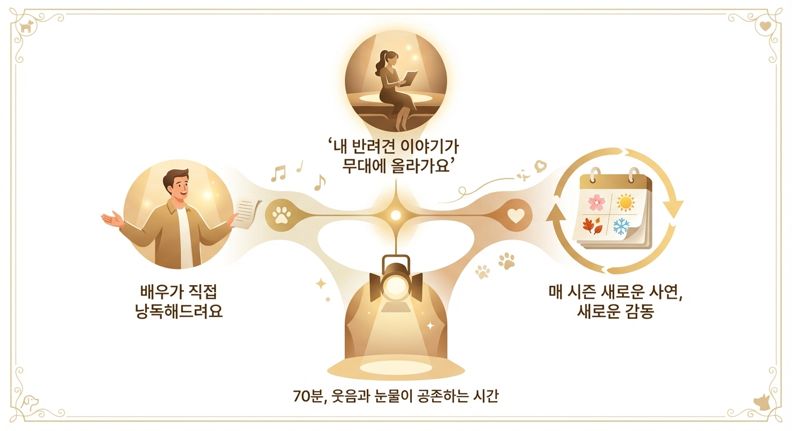

# 뮤지컬 《오늘의 사연》 공연 안내

> 창작 낭독 뮤지컬 | 8주 64회 | 소극장 150석

---

## 이 공연은 어떤 공연인가요?

반려견과 함께한 첫날의 설렘, 비 오는 날의 산책, 잊지 못할 작별의 순간—당신이 간직해온 그 이야기가 오늘 무대 위에서 살아납니다. 뮤지컬 《오늘의 사연》은 반려인이 직접 제보한 실제 에피소드를 배우의 목소리와 피아노 선율로 공연화하는 참여형 낭독 뮤지컬입니다. 내 반려견의 이야기가 예술이 되는 순간, 극장 안의 모든 사람이 함께 웃고 함께 눈물 흘립니다.

---

## 이런 분들께 추천합니다

- 반려견과 함께한 소중한 기억을 가슴 속에 품고 있는 모든 반려인
- 내 이야기가 무대에 올라가는 특별한 경험을 해보고 싶은 분
- 잔잔하지만 깊은 감동을 주는 성인 감성 공연을 찾고 계신 분
- 반려견을 떠나보낸 후 그리움을 따뜻하게 나누고 싶은 분
- 반려견을 처음 입양한 기쁨과 설렘을 함께 공유하고 싶은 분

---

## 관람 포인트

### 내 이야기가 무대가 됩니다

관객이 직접 제보한 반려견 에피소드가 선별되어 실제 공연에 반영됩니다. 사연이 채택되면 배우의 목소리로 당신의 이야기가 극장 안에 울려 퍼지는 전례 없는 경험을 하게 됩니다. "내 반려견 이야기가 예술이 되었다"는 감동은 어떤 공연에서도 느낄 수 없는 것입니다.

### 배우의 목소리가 전하는 진짜 감동

화려한 무대 장치 대신, 배우 두 사람의 목소리와 라이브 피아노 선율만으로 70분을 채웁니다. 불필요한 것을 모두 걷어낸 자리에 남은 것은 순수한 이야기의 힘입니다. 눈을 감으면 내 반려견의 모습이 선명하게 떠오르는 시간을 경험하실 것입니다.

### 매 시즌 새로운 사연, 매번 새로운 감동

《오늘의 사연》은 시리즈로 이어지는 공연입니다. 매 시즌 새로운 에피소드가 무대에 오르기 때문에, 한 번 보고 나면 다음 시즌이 기다려지는 충성스러운 관객이 됩니다. 반려인 친구와 함께, 또 다음 시즌에도 다시 극장으로 오시게 될 것입니다.

---

## 주요 장면

### 입양의 첫날 — 그 작고 떨리던 존재

처음 품에 안았던 그 순간을 기억하시나요? 작고 따뜻하고, 어쩐지 조금 떨리던 그 아이. 무대 위 배우가 그 첫날의 감동을 고스란히 되살려냅니다. 관객석 곳곳에서 나도 모르게 눈물이 맺히는 장면입니다.

---

### 함께한 산책 — 평범한 오후의 특별함

리드줄을 쥔 손의 온기, 발걸음을 맞추며 걷던 공원의 오후. 배우가 재현하는 일상의 산책 장면은 반려인이라면 누구나 고개를 끄덕이게 되는 따뜻한 공감의 시간입니다. 아주 평범한 하루가 얼마나 소중했는지를 새삼 깨닫게 해주는 장면입니다.

---

### 이별의 편지 — 스팟라이트 아래의 클라이맥스

공연의 클라이맥스. 스팟라이트 하나가 무대를 비추고, 배우는 낮고 떨리는 목소리로 편지를 읽기 시작합니다. 보내야 했던 그 마지막 날, 하지 못했던 말들이 극장 전체를 가득 채우는 순간입니다. 함께 울어도 괜찮습니다. 극장은 오늘 당신의 편입니다.

---

### 커뮤니티의 박수 — 함께하기에 더 아름다운 피날레

눈물을 닦고 나면 따뜻한 기립박수가 극장을 가득 채웁니다. 낯선 이들이지만 오늘만큼은 모두 같은 마음으로 이어진 반려인 커뮤니티. 공연이 끝난 후에도 오랫동안 여운이 남는 피날레입니다.

---

## 공연 정보

| 항목 | 내용 |
|------|------|
| 공연 기간 | 8주 (64회) |
| 공연장 | 소극장 (150석) |
| 공연 시간 | 70분 (인터미션 없음) |
| 관람 연령 | 전 연령 (성인 반려인 권장) |
| 티켓 가격 | 45,000원 (R석 기준) |

---

## 예매 안내

- **예매처**: 인터파크 티켓, 멜론티켓
- **단체 문의**: 극단 사무국 (단체 10인 이상 문의 환영)

---

*극단 | 공연 기획 문의 환영*
