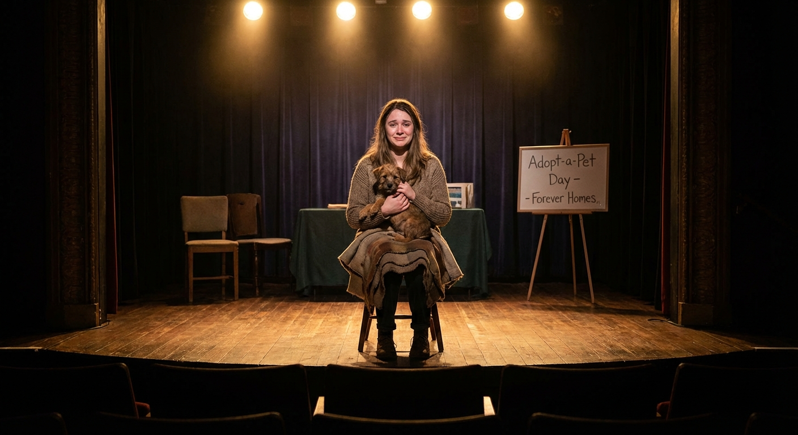
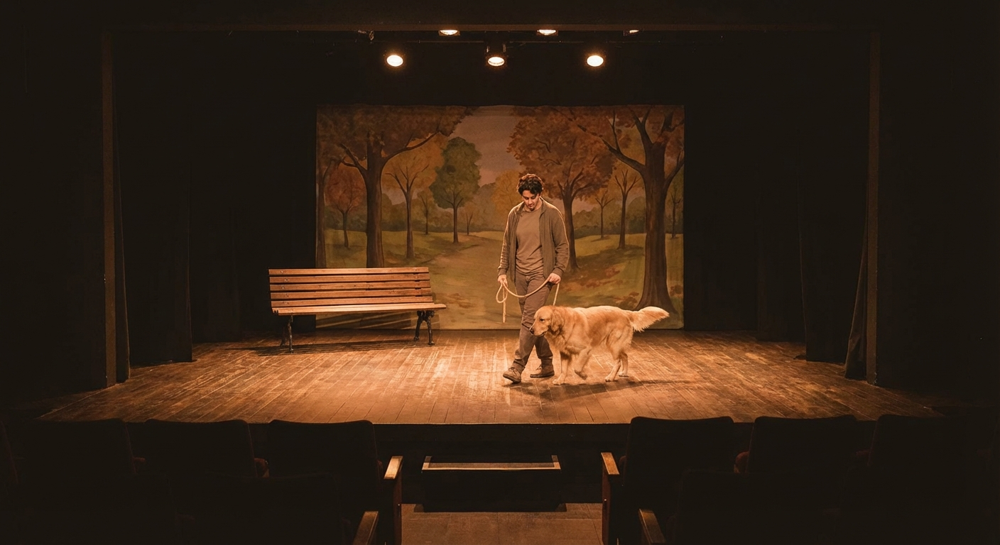
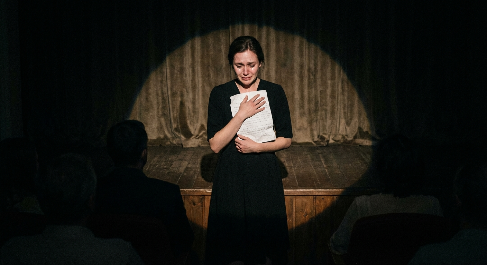

# 뮤지컬 《오늘의 사연》 고객 대상 프레젠테이션 개요

> 발표 대상: 관람객·구매자(반려인·커플·모임 등 일반 관객) | 발표 일자: 2026-03-09

---

## 슬라이드 1: 표지

- **작품명**: 뮤지컬 《오늘의 사연》
- **부제**: "당신의 가장 충실한 친구, 그 이야기를 무대 위에서 만나다"
- **공연 기간 & 공연장**: 2026년 시즌 공연 (8주) | 소극장 (150석)
- [이미지 삽입: `./images/overview-concept.png` 전면 배경]

---

## 슬라이드 2: 작품 소개

- **작품명 & 장르**: 뮤지컬 《오늘의 사연》 — 창작 낭독 뮤지컬 (시리즈)
- **한 줄 소개**: 당신이 보내준 반려견의 이야기가, 오늘 밤 무대 위에서 살아 숨 쉽니다.
- **시놉시스** (감성적 톤):
  > 떨리는 손으로 처음 안은 그 작은 온기, 아무 말 없이 곁에 있어 준 그 존재, 그리고 언젠가 마주해야 할 이별까지. 뮤지컬 《오늘의 사연》은 반려인이라면 누구나 가슴 한편에 품고 있는 진짜 이야기들을 무대 위에 꺼내 놓습니다. 웃음과 눈물이 교차하는 70분, 당신의 이야기가 무대의 이야기가 되는 특별한 경험을 선사합니다.
- [이미지 삽입: `./images/overview-concept.png`]

---

## 슬라이드 3: 이 공연을 봐야 하는 이유

- **관람 포인트 1 — 내 이야기가 무대에 올라갑니다**
  반려견 에피소드를 직접 제보하면 실제 무대에서 낭독됩니다. 세상에서 하나뿐인, 나만의 공연이 시작됩니다.

- **관람 포인트 2 — 매 시즌 새로운 감동**
  시리즈 구조로 매번 다른 사연, 다른 눈물과 웃음을 만납니다. 올 시즌도, 다음 시즌도 다시 찾아오게 되는 공연입니다.

- **관람 포인트 3 — 70분, 웃음과 눈물이 공존하는 시간**
  반려인이라면 누구나 공감하는 따뜻한 감성 공연. 인터미션 없이 이어지는 70분 동안 마음이 가득 채워집니다.

- **추천 관객**:
  - 반려견과 함께 살아가는 모든 반려인
  - 소중한 반려견과의 추억을 간직하고 싶은 분
  - 특별한 데이트·모임을 찾는 반려인 커플·친구

---

## 슬라이드 4: 주요 장면 ①②

| 장면 | 이미지 | 설명 |
|------|--------|------|
| 첫 만남 — 입양의 첫날 |  | 떨리는 마음으로 작은 생명을 처음 품에 안는 순간. 그 온기와 설렘이 무대 위에서 고스란히 전해집니다. |
| 함께한 산책 |  | 리드줄 하나로 연결된 두 존재의 평화로운 산책. 무심한 일상이 얼마나 소중한 행복이었는지 느끼게 됩니다. |

> 이미지 경로: `./images/scene-01.png`, `./images/scene-02.png`

---

## 슬라이드 5: 주요 장면 ③④

| 장면 | 이미지 | 설명 |
|------|--------|------|
| 이별의 편지 — 클라이맥스 |  | 스팟라이트 아래 홀로 선 배우가 낭독하는 편지 한 장. 무대 전체가 숨을 멈추는, 이 공연의 가장 뜨거운 순간입니다. |
| 커뮤니티의 박수 — 피날레 |  | 기립박수가 쏟아지는 골드빛 피날레. 눈물과 웃음이 뒤섞인 감동의 엔딩이 오래도록 여운을 남깁니다. |

> 이미지 경로: `./images/scene-03.png`, `./images/scene-04.png`

---

## 슬라이드 6: 공연 정보

- **공연 기간**: 2026년 시즌 공연 (8주)
- **공연장**: 소극장 (150석)
- **공연 시간**: 70분 (인터미션 없음)
- **관람 연령**: 전 연령 (성인 반려인 권장)
- **티켓 가격**: R석 45,000원 (좌석 등급별 상이)
- **예매처**: 인터파크 티켓 / YES24 티켓

---

## 슬라이드 7: 마무리 & 문의

- **마무리 메시지**:
  > 오늘 밤, 당신 곁의 가장 충실한 친구를 떠올리며 무대 앞에 앉아 보세요.
  > 그 이야기가 어느새 눈물이 되고, 웃음이 되고, 따뜻한 기억이 됩니다.
  > 뮤지컬 《오늘의 사연》이 당신을 기다리고 있습니다.

- [이미지 삽입: `./images/concept-poster.png`]

- **단체 문의**: 극단 내 고객 문의 채널을 통해 단체 예약 및 특별 패키지 안내 가능
- **기획사**: 극단 혜윰 | 창작 낭독 뮤지컬 전문 제작사
