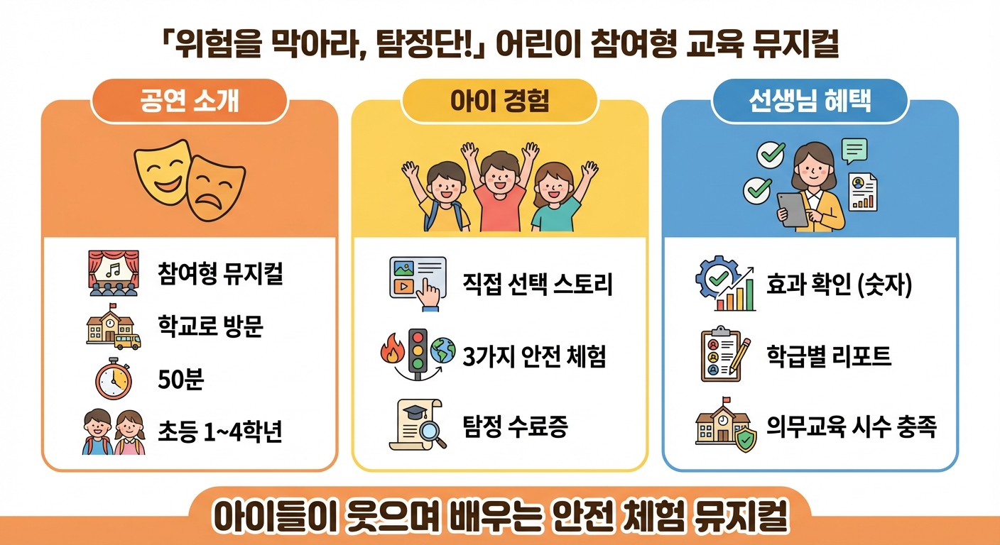
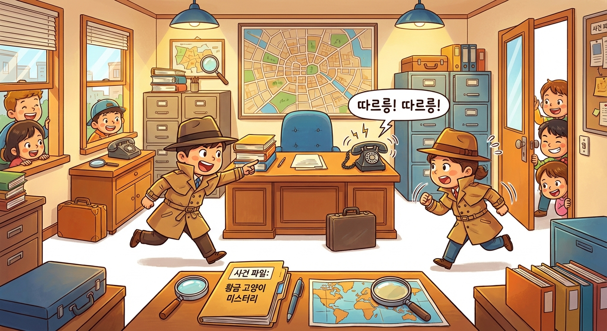
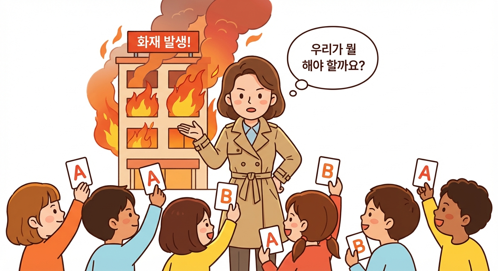
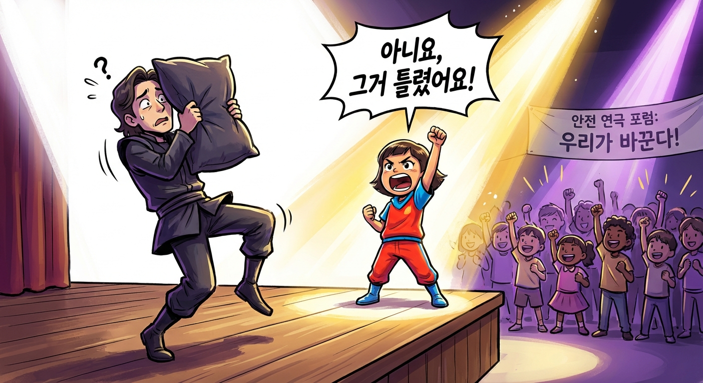
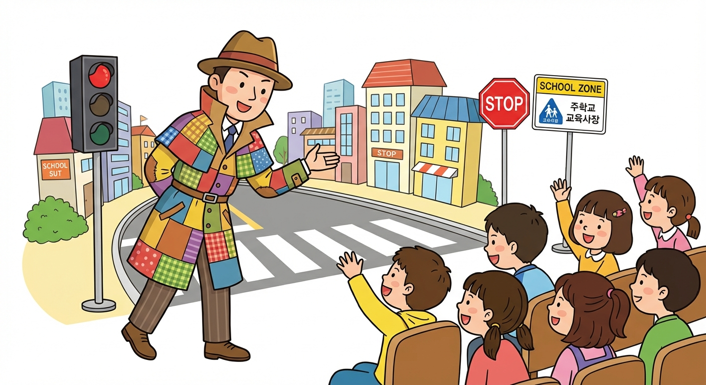
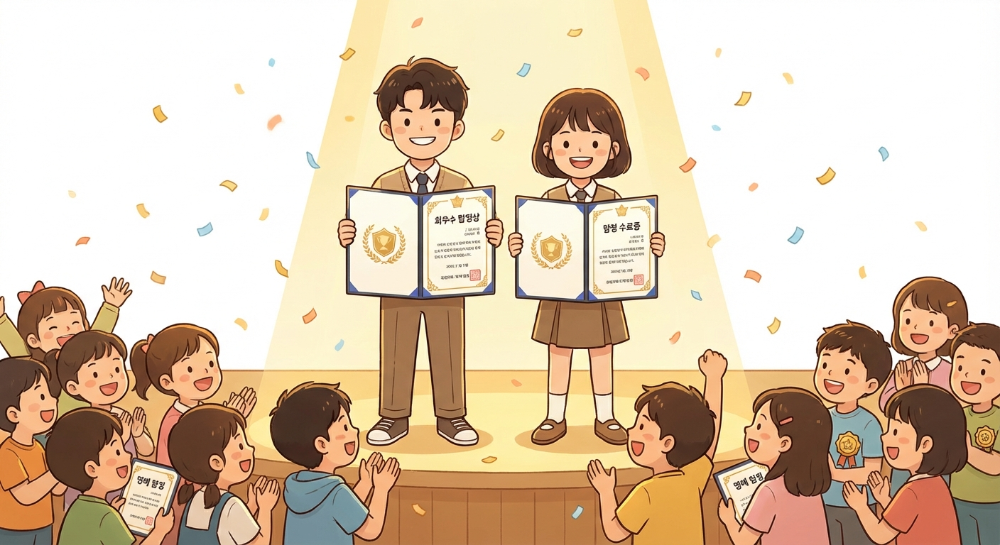

# 위험을 막아라, 탐정단! 공연 안내

> 어린이 참여형 안전교육 뮤지컬 | 2026년 4월~ | 전국 학교·기관 방문 공연

---

## 이 공연은 어떤 공연인가요?

아이들이 직접 탐정이 되어 화재·교통·지진 위기를 함께 해결하는 50분간의 두근두근 안전 모험입니다. 관람석에 앉아 보기만 하는 공연이 아닙니다. 아이들이 손을 들고, 목소리를 높이고, 때로는 무대 위 잘못된 행동을 멈추게 만드는 바로 그 순간, 안전 습관은 머릿속이 아니라 몸속 깊이 새겨집니다. 웃음과 긴장과 감동이 한데 어우러진 이 공연에서, 우리 아이들은 스스로 영웅이 되는 경험을 합니다.

---

## 이런 분들께 추천합니다

- **안전교육 의무 시수를 체험 중심으로 충족하고 싶은 학교 선생님과 원장 선생님** — 화재·교통·지진 복합 안전 주제를 한 번의 공연으로 다루며, 공연 전후 학습 변화 리포트를 바로 받아보실 수 있습니다.
- **아이와 함께 특별한 체험을 찾고 있는 부모님** — 아이가 직접 이야기를 바꾸고 탐정 수료증을 받아 돌아오는, 평범한 주말을 특별한 기억으로 바꿔줄 가족 공연입니다.
- **어린이 대상 안전문화 교육 프로그램을 기획하는 공공기관 담당자** — 검증된 인터랙티브 방법론으로 어린이의 실질적 안전 행동 변화를 이끌어내는 콘텐츠를 찾으신다면 이 공연이 답입니다.

---

## 관람 포인트

### 1. 내가 선택하면 이야기가 바뀐다 — 인터랙티브 분기형 경험

화재 현장, 교통 위기의 갈림길에서 탐정들이 묻습니다. "어떻게 할까요?" 아이들이 손을 들어 선택하면, 무대 위 이야기가 실제로 달라집니다. 우리 아이들이 이야기의 관객이 아닌 주인공이 되는 순간, 안전 판단력은 자연스럽게 훈련됩니다.

### 2. 웃으며 배우고, 수치로 확인하는 안전교육 효과

공연 전후에 동일한 OX 안전 퀴즈를 진행합니다. 공연이 끝나면 학급별 안전 인식 향상률이 담긴 리포트를 선생님께 바로 드립니다. "우리 아이들이 얼마나 배웠을까?"라는 질문에 숫자로 답하는, 국내 최초의 교육 효과 측정 안전 뮤지컬입니다.

### 3. 탐정 수료증을 받아 집으로 — 감동의 피날레와 이어지는 안전 대화

모든 위기를 함께 해결한 아이들에게 탐정 수료증이 수여됩니다. 수료증을 손에 쥔 아이의 눈빛은 달라집니다. 그 수료증이 집으로 향하는 날, 부모님과 아이 사이에 자연스러운 안전 대화가 시작됩니다.

---

## 주요 장면

### 오프닝: 탐정 사무소 긴급 출동!

활기찬 탐정 사무소에 긴급 사건 의뢰가 들어옵니다. 홍길동 탐정과 김영희 탐정이 함께 출동 준비를 시작하는 이 장면에서, 아이들은 이미 탐정의 동료가 되어 두근거리는 모험 속으로 뛰어들게 됩니다.

---

### 화재 위기: 우리가 결정한다!

화재 현장에서 탐정이 묻습니다. "어떻게 할까요?" 아이들이 손을 들어 이야기를 바꾸는 짜릿한 순간입니다. 내 선택이 무대 위 결과를 직접 만들어낸다는 경험은, 화재 대피 요령을 자연스럽게 몸에 각인시킵니다.

---

### 포럼 씨어터: 우리 아이가 영웅!

무대 위에서 잘못된 행동이 반복될 때, 아이들이 자신 있게 외칩니다. "그러면 안 돼요!" 아이의 목소리 하나가 무대를 멈추게 하는 이 클라이맥스에서, 안전 지식은 지식이 아닌 신념으로 바뀝니다.

---

### 교통 안전: 함께 배우는 횡단보도

신호등 앞, 올바른 교통안전 행동을 탐정들과 함께 하나씩 확인합니다. 무대에서 함께 배운 것을 내일 등굣길에서 바로 실천할 수 있도록, 장면 하나하나를 실제 상황처럼 생생하게 구성했습니다.

---

### 피날레: 탐정 수료증 수여!

모든 사건을 해결한 어린이 탐정들에게 수료증이 수여되는 감동의 순간입니다. 성취감으로 빛나는 아이들의 눈빛과 함성이 강당을 가득 채우는 이 피날레는, 공연이 끝난 후에도 오래도록 기억에 남습니다.

---

## 공연 정보

| 항목 | 내용 |
|------|------|
| 공연 기간 | 2026년 4월~ |
| 공연장 | 전국 초등학교·유치원·어린이집 강당 및 지역 문화시설 (방문 공연) |
| 공연 시간 | 50분 (공연 전후 OX 안전 퀴즈 각 15분 별도) |
| 관람 연령 | 유치원 ~ 초등학교 전 학년 (최적: 초등 1~4학년) |
| 티켓 가격 | B2B 학교·기관 계약: 회당 100~150만 원 / B2C 가족 공연: 1인 15,000~20,000원 |

---

## 예매 및 계약 안내

- **학교·기관 단체 계약 문의**: 어린이 안전교육 공연단 운영팀 (이메일·전화 문의)
- **가족 공연 예매**: 방학 시즌 개별 공연 일정 확정 후 인터파크·네이버 예약 오픈 예정
- **교육청 공모사업 연계 문의**: 학교안전교육 의무 시수 인정 가능 여부 및 지원 서류 안내 제공

> **학교 방문 공연의 경우,** 일정·장소·관객 규모에 맞춘 맞춤 제안을 드립니다. 먼저 문의해 주세요.

---

*어린이 안전교육 공연단 | 공연 문의: 담당자 이메일·전화 문의 | 공연 일정 업데이트: 공식 채널 안내 예정*
