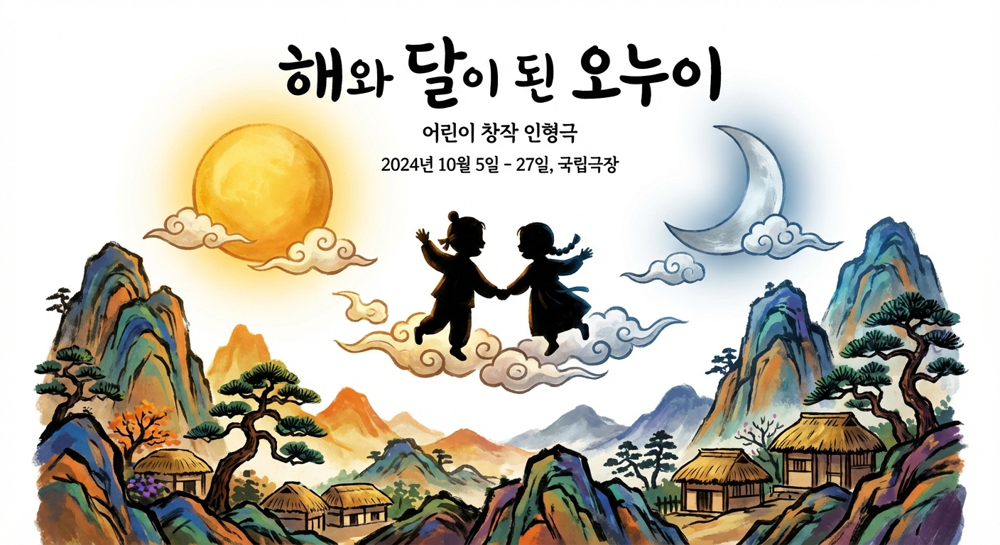
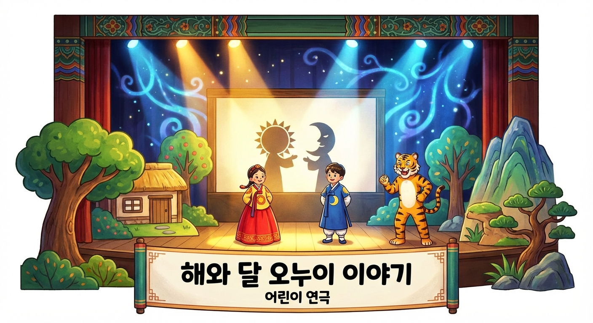

# 해와 달이 된 오누이 - 빛의 모험 기획 제안서

> 어린이 연극 | 제안일: 2026-03-09

---

## 1. 작품 개요

| 항목 | 내용 |
|------|------|
| 작품명 | 해와 달이 된 오누이 - 빛의 모험 |
| 장르 | 어린이 뮤지컬 인터랙티브 연극 |
| 원작 | 한국 전래동화 "해와 달이 된 오누이" |
| 타겟 연령 | 3~7세 미취학 아동 (동반 보호자 포함) |
| 공연 형태 | 소극장 공연 (서울 초연) + 지역 순회 |
| 공연 규모 | 150석 소극장, 서울 80회 + 지역 순회 40회 (총 120회) |
| 총 예산 | 191,600,000원 |

### 주요 특징

- **원작 서사의 충실한 재현**: 호랑이, 오누이, 하늘 승천의 3막 구조로 권선징악의 핵심 메시지를 전달
- **뮤지컬 + 인터랙티브 형식**: 아이들이 공연에 직접 참여하는 몰입형 관람 경험 제공
- **전통 예술 요소 결합**: 한국 전통 미학을 현대적 연출로 재해석, 해외 레퍼런스(그림자 인형극, 빛/어둠 시각 연출)에서 검증된 방식 적용
- **교육적 가치**: 용기, 협동, 자연과의 공존이라는 보편적 메시지로 부모 공감대 형성

---

## 2. 기획 의도

### 기획 배경

한국 어린이 공연 시장은 연간 1,200~1,500편이 제작되고 총 관객이 350~450만 명에 달하는 규모로 성장했습니다. 그러나 이 가운데 한국 전래동화를 소재로 하면서도 교육성과 오락성을 동시에 충족하는 공연은 여전히 희소합니다. 국립극단 전래동화 시리즈가 브랜드 신뢰도를 바탕으로 시장을 선도하고 있으나, 연출의 정형화라는 한계가 지적됩니다. 반면 극단 사다리의 인터랙티브 방식은 높은 몰입도를 자랑하지만 전래동화 특화 콘텐츠가 부족합니다.

이 지점에서 "해와 달이 된 오누이 - 빛의 모험"은 명확한 기회를 발견합니다.

### 기획 목적

1. 한국 대표 전래동화를 현대적 뮤지컬 언어로 재해석하여 미취학 아동의 첫 공연 경험으로 자리매김
2. 인터랙티브 형식을 통해 아이와 부모가 함께 참여하는 가족 문화 콘텐츠로 브랜드화
3. 소극장 초연을 통해 작품성을 검증한 뒤 지역 순회로 확장, 지속 가능한 레퍼토리 공연으로 운영

### 차별화 전략

| 구분 | 기존 경쟁작 | 본 작품 |
|------|------------|--------|
| 콘텐츠 | 전래동화 또는 인터랙티브, 양자택일 | 전래동화 + 인터랙티브 결합 |
| 연출 | 정형화된 무대 연출 | 빛/어둠 시각 연출 + 전통 예술 요소 |
| 관람 경험 | 관람 중심 | 아동 참여형 몰입 경험 |
| 확장성 | 단일 공간 운영 | 소극장 초연 후 지역 순회 |

핵심 메시지: **"빛으로 만나는 우리 이야기 - 해와 달이 들려주는 자연과 용기의 노래"**

---

## 3. 시장 분석

### 시장 현황

국내 어린이 공연 시장은 안정적인 규모를 유지하고 있으며, 구조적으로 단체 관람 수요가 높아 기획사 입장에서 수익 예측이 비교적 용이한 시장입니다.

| 지표 | 현황 |
|------|------|
| 연간 공연 편수 | 약 1,200~1,500편 |
| 연간 총 관객 | 약 350~450만 명 |
| 평균 객석 점유율 | 65~75% |
| 단체 관람 비율 | 55~65% |

**성수기 일정**
- 봄 시즌: 3~6월 (단체 관람 집중)
- 여름 방학: 7~8월
- 겨울 방학: 12~2월

### 타겟 관객

**주 타겟**: 3~7세 미취학 아동 + 30대 중반~40대 초반 부모

**부 타겟**: 초등 저학년 + 단체 관람 (어린이집, 유치원, 초등학교)

| 구분 | 가격 |
|------|------|
| 개인 관람 | 25,000~35,000원 |
| 단체 관람 | 15,000~20,000원 |

**관람 결정 요인 (중요도 순)**
1. 교육적 가치
2. 연령 적합성
3. 접근성
4. 후기 및 평판

### 경쟁작 분석

| 경쟁작 | 강점 | 약점 | 본 작품의 포지션 |
|--------|------|------|-----------------|
| 국립극단 전래동화 시리즈 | 브랜드 신뢰도, 객석 점유율 75~85% | 연출 정형화 | 인터랙티브 차별화로 새로운 경험 제공 |
| 극단 사다리 | 높은 몰입도, 연간 200~300회 운영 | 전래동화 특화 부족 | 전래동화 기반 정체성으로 시장 빈틈 공략 |

### 예상 관객 수

| 시나리오 | 점유율 | 관객 수 |
|---------|--------|--------|
| 낙관 시나리오 | 90% 이상 | 19,200명 (순회 포함 120회) |
| 기본 시나리오 | 72% | 8,640명 (소극장 150석, 80회) |

---

## 4. 제작 계획

### 작품 구성

- **형식**: 뮤지컬 + 인터랙티브 어린이 연극
- **원작 서사**: 호랑이 등장 - 오누이의 도주 - 하늘 승천의 3막 구조
- **핵심 메시지**: 권선징악, 용기, 협동, 자연과의 공존
- **연출 컨셉**: 빛과 어둠의 시각적 대비, 전통 예술 요소(그림자 인형극 기법 포함) 결합

### 공연 일정

| 단계 | 내용 | 목표 시즌 |
|------|------|----------|
| 서울 초연 | 소극장 150석, 80회 | 봄 성수기 (3~6월) 집중 편성 |
| 지역 순회 | 40회 추가 | 방학 시즌 (7~8월, 12~2월) |

### 공연 규모 및 장소

- **서울 초연**: 소극장 150~200석 규모 공연장 (국립극단 소극장 달오름 등 유사 공간 기준)
- **지역 순회**: 전국 주요 도시 지역 문화예술회관 및 소극장
- **총 120회** 운영으로 지속 가능한 레퍼토리 확립

### 레퍼런스 벤치마킹

| 레퍼런스 | 적용 요소 |
|---------|---------|
| 국립극단 어린이 전래동화 시리즈 | 단체 관람 60~70% 운영 구조, 공신력 있는 공연 방식 |
| 극단 사다리 | 인터랙티브 방식, 연간 200~300회 안정적 운영 모델 |
| 해외 "Why the Sun and Moon Live in the Sky" | 그림자 인형극, 빛/어둠 시각 연출 기법 |
| 극단 여행자 | 전통 예술 결합, 해외 초청 가능성 검토 |

---

## 5. 예산 계획

### 총 예산 요약

| 분류 | 금액 | 비율 |
|------|------|------|
| 제작비 | 73,700,000원 | 38.5% |
| 출연료 | 32,800,000원 | 17.1% |
| 운영비 | 55,400,000원 | 28.9% |
| 마케팅비 | 18,000,000원 | 9.4% |
| 예비비 | 11,700,000원 | 6.1% |
| **총계** | **191,600,000원** | **100%** |

### 손익분기점 분석

서울 초연(80회) + 지역 순회(40회) 통합 기준 (총 120회)으로 산정합니다.

| 항목 | 금액 |
|------|------|
| 총 비용 | 211,600,000원 (지역 순회 추가 20,000,000원 포함) |
| 손익분기 관객 수 | 약 12,573명 |
| BEP 점유율 | 약 70% |

기본 점유율 70% 달성 시 손익분기에 도달하며, 이는 시장 평균 점유율(65~75%) 범위 내에 위치하는 현실적 목표입니다.

### 시나리오별 수익 전망

| 시나리오 | 점유율 | 예상 수익 |
|---------|--------|---------|
| 낙관 | 90% | 약 +61,220,000원 수익 |
| 기본 | 70% | 약 +460,000원 (BEP 근접) |
| 보수 | 50% | 약 -60,130,000원 손실 |

**시사점**: 시장 평균 점유율(65~75%) 달성 시 손익분기 도달이 가능하며, 단체 관람 비율을 55% 이상으로 유지하는 것이 수익 안정성의 핵심 변수입니다.

---

## 6. 마케팅 전략

### 핵심 마케팅 메시지

> "빛으로 만나는 우리 이야기 - 해와 달이 들려주는 자연과 용기의 노래"

이 메시지는 부모 세대에게는 교육적 가치와 문화적 정체성을, 아이들에게는 빛과 모험의 설렘을 동시에 전달합니다.

### 채널별 마케팅 전략

**1. 단체 관람 집중 공략 (최우선)**

시장 내 단체 관람 비율이 55~65%에 달하는 구조를 적극 활용합니다.
- 어린이집, 유치원, 초등학교 대상 단체 관람 패키지 기획
- 단체 가격: 15,000~20,000원 구간으로 진입 장벽 최소화
- 성수기(3~6월 봄 단체 시즌) 사전 예약 캠페인 집중 운영
- 교육청 연계 문화 체험 프로그램 등록 추진

**2. 디지털 마케팅**

관람 결정 요인 중 '후기/평판'의 중요성을 고려하여 바이럴 효과를 극대화합니다.
- 인스타그램, 유튜브 등 부모 커뮤니티 채널 중심 콘텐츠 운영
- 공연 하이라이트 영상, 아이 반응 영상 등 감성 콘텐츠 배포
- 육아 인플루언서 초청 관람 및 후기 콘텐츠 협업

**3. 교육 가치 마케팅**

관람 결정 요인 1순위인 '교육적 가치'를 전면에 내세웁니다.
- 공연 연계 교육 자료(워크북, 스티커북) 제작 및 배포
- "전래동화로 배우는 용기와 나눔" 교육 연계 포인트 명시
- 공연 후 포토존, 캐릭터 만남 행사로 가족 경험 완성

**4. 지역 순회 마케팅**

- 지역 문화예술회관 공동 홍보 협력
- 지역 언론 및 지역 맘카페 커뮤니티 타깃 홍보
- 방학 시즌(7~8월, 12~2월) 집중 공연으로 가족 관람 수요 흡수

---

## 7. 기대 효과

### 예상 성과

**관객 성과**

| 목표 시나리오 | 총 관객 | 점유율 |
|-------------|--------|--------|
| 기본 목표 | 8,640명 (서울 80회) | 72% |
| 확장 목표 | 19,200명 (순회 포함 120회) | 90% 이상 |
| 손익분기 | 12,573명 (120회 기준) | 70% |

**재무 성과**

- 기본 점유율(70%) 달성 시 손익분기 도달, 사업 지속 가능성 확보
- 낙관 시나리오(90%) 실현 시 약 6,122만원 수익으로 차기작 제작 재원 확보

### 중장기 파급 효과

1. **레퍼토리 자산화**: 소극장 초연 검증 후 지역 순회 → 상설 공연으로 단계적 확장 가능한 레퍼토리 구축
2. **브랜드 구축**: 한국 전래동화 뮤지컬 전문 기획사로서의 브랜드 포지션 확립, 차기 전래동화 시리즈 기반 마련
3. **해외 진출 가능성**: 전통 예술 결합 콘텐츠의 해외 초청 공연 가능성 내재, 아시아권 한류 어린이 문화 콘텐츠로 확장 검토
4. **사회적 가치**: 한국 전래동화를 통한 문화 정체성 교육, 미취학 아동의 문화 예술 향유 기회 확대에 기여

---

## 부록

### 참고 레퍼런스

| 레퍼런스 | 주요 지표 | 참조 포인트 |
|---------|---------|-----------|
| 국립극단 어린이 전래동화 시리즈 | 객석 점유율 75~85%, 단체 관람 60~70% | 전래동화 공연 수요 및 단체 관람 운영 구조 |
| 극단 사다리 | 연간 200~300회 운영 | 인터랙티브 아동극 지속 운영 모델 |
| 해외 "Why the Sun and Moon Live in the Sky" | 그림자 인형극, 빛/어둠 시각 연출 | 동일 소재 해외 연출 기법 |
| 극단 여행자 | 전통 예술 결합, 해외 초청 실적 | 전통 예술 결합 콘텐츠의 해외 확장성 |

### 시장 기초 데이터

- 국내 어린이 공연 연간 편수: 약 1,200~1,500편
- 연간 총 관객: 약 350~450만 명
- 평균 객석 점유율: 65~75%
- 단체 관람 비율: 55~65%

### 컨셉 이미지

---

*본 제안서는 01-research.md, 02-market-analysis.md, 03-budget-plan.md의 선행 분석 결과를 기반으로 작성되었습니다.*
*작성: 라이터 (김지은) | 2026-03-09*
