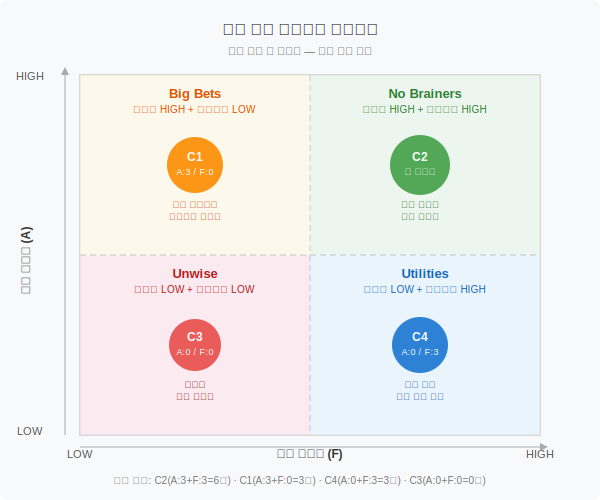

# 핵심 공연 컨셉 선정

작성일: 2026-03-09
작성자: 라이터 (proposal-writer)
대상 작품: 해와 달이 된 오누이

---

## 1. 투표 결과

| 컨셉 ID | 컨셉명 | 관객 매력도 (A) | 실현 가능성 (F) | A+F 합계 |
|--------|------|:---:|:---:|:---:|
| C1 | 빛과 그림자의 이머시브 서사극 | 3/6 | 0/6 | 3 |
| C2 | 관객 참여형 선택 서사극 | 3/6 | 3/6 | **6** |
| C3 | 역서사 이중 시점극 | 0/6 | 0/6 | 0 |
| C4 | 전통 민화 체험 연계 교육 공연 | 0/6 | 3/6 | 3 |

> 투표 집계 기준: 관객 매력도(A) 최대 6점 + 실현 가능성(F) 최대 6점 = 총 12점 만점. 각 3점은 과반 이상 지지를 의미함.

---

## 2. 우선순위 매트릭스

| 영역 | 해당 컨셉 | 설명 |
|------|---------|-----|
| No Brainers (최우선) | C2 관객 참여형 선택 서사극 | 관객 매력도 HIGH + 실현 가능성 HIGH — 즉시 추진 권장 |
| Big Bets (도전 투자) | C1 빛과 그림자의 이머시브 서사극 | 관객 매력도 HIGH + 실현 가능성 LOW — 조건부 추진 검토 |
| Utilities (실용 보완) | C4 전통 민화 체험 연계 교육 공연 | 관객 매력도 LOW + 실현 가능성 HIGH — 보조 프로그램 활용 |
| Unwise (보류) | C3 역서사 이중 시점극 | 관객 매력도 LOW + 실현 가능성 LOW — 현 시점 추진 불가 |

---

## 3. 핵심 공연 컨셉 (2개 선정)

### 핵심 컨셉 1: 관객 참여형 선택 서사극 — "오누이야, 어떻게 할까?" ★ 최우선 (No Brainers)

- **선정 근거**: 두 에이전트 투표에서 관객 매력도(3/6)와 실현 가능성(3/6) 모두 과반 지지를 획득한 유일한 컨셉. A+F 합계 6점으로 전체 1위. 우선순위 매트릭스 No Brainers 영역에 위치하여 즉시 추진이 타당함.
- **관객 매력도**: 3/6
- **실현 가능성**: 3/6
- **핵심 경험 가치**: 관객 투표와 미션 참여가 실제 공연 서사를 바꾸는 경험. 수동적 관람에서 능동적 참여로 전환하여 어린이가 이야기의 결말을 직접 만들어가는 주체가 됨. 교육과정 핵심 역량(협력, 의사결정, 공동체)과 자연스럽게 연결.
- **공연 형태**: 참여형 뮤지컬 (70~80분). 공연 중 2~3회 관객 투표 분기점. 노래 4곡 삽입. 교육과정 1:1 매핑 커리큘럼 자료 제공. 미션 스테이지 요소로 조명/음향 반응.
- **차별화 포인트**: Netflix Bandersnatch의 선택형 서사 구조를 라이브 무대에 구현. 교육 기관 의사결정자에게 '수업 연계 가능한 공연'으로 B2B 세일즈 포인트 확보.
- **Needs Statement 연결**: '교육과정과 자연스럽게 연결되면서도 디지털 콘텐츠로는 대체할 수 없는 현장 참여형 문화 체험'이라는 핵심 니즈를 관객 투표 분기 서사와 교육과정 매핑 자료로 직접 충족. 교육 기관 의사결정자의 구매 명분 제공. 5~10세 자녀를 둔 부모에게는 자녀의 능동적 참여를 눈으로 확인하는 체험 가치 제공.
- **수렴 출처**: market-analyst Big Idea 2 (오누이 퀘스트) + proposal-writer Big Idea 2 (뮤지컬 참여극) — 종합 유사도 0.755

---

### 핵심 컨셉 2: 빛과 그림자의 이머시브 서사극 — "우리가 해와 달이 되는 날" (Big Bets)

- **선정 근거**: 관객 매력도에서 과반 지지(3/6)를 받아 시장 흡인력이 검증되었으나, 실현 가능성(0/6)이 낮아 조건부 추진 대상으로 선정. 현재 예산·기술 조건에서 규모를 조정하여 단계적 실행 가능성을 검토할 필요가 있음. A+F 합계 3점으로 C4와 공동 2위.
- **관객 매력도**: 3/6
- **실현 가능성**: 0/6
- **핵심 경험 가치**: 관객이 빛의 공간 안에서 직접 이야기의 일부가 되는 시각적 몰입 체험. 360도 프로젝션 매핑과 그림자극이 결합된 라이팅 아트로 디지털 콘텐츠(OTT, 유튜브)로 대체 불가능한 현장 감각 자극.
- **공연 형태**: 이머시브 씨어터 (60~70분). 360도 프로젝션 매핑 + 반투명 스크린 그림자극 + 라이팅 아트. 어린이 동아줄 당기기 등 소규모 신체 참여 포함.
- **차별화 포인트**: 팀랩 스타일의 몰입형 시각 연출을 어린이 전래동화 공연에 적용한 국내 최초 시도. 부모 동반 관람 시 성인도 충분히 만족하는 미적 체험 제공.
- **Needs Statement 연결**: '디지털 콘텐츠로는 대체할 수 없는 현장 참여형 문화 체험'이라는 니즈를 라이팅 이머시브 연출로 직접 충족. 5~10세 자녀와 부모 모두의 문화 체험 욕구 해소. 단, 실현 가능성 제약으로 인해 핵심 컨셉 1의 보완 또는 후속 시즌 확장 컨셉으로 위치시키는 것이 현실적.
- **수렴 출처**: market-analyst Big Idea 1 (빛의 오누이) + proposal-writer Big Idea 1 (빛과 그림자의 서사극) — 종합 유사도 0.705
- **추진 조건**: 기술·예산 제약 해소 시 단독 추진 전환 가능. 단기적으로는 핵심 컨셉 1(관객 참여형)의 조명·시각 연출 요소에 부분 통합하는 방식 검토.

---

### 보류 컨셉

| 컨셉 ID | 컨셉명 | 보류 사유 |
|--------|------|---------|
| C4 전통 민화 체험 연계 교육 공연 | Utilities | 실현 가능성은 높으나 관객 매력도(0/6) 미달. 단독 기획보다 핵심 컨셉 1의 사전 워크숍·학습지 연계 요소로 흡수하는 보조 전략으로 활용 권장. |
| C3 역서사 이중 시점극 | Unwise | 관객 매력도(0/6)와 실현 가능성(0/6) 모두 지지 없음. 양면 무대·이중 공간 운영의 운영 복잡도와 타겟(5~10세) 인지 수준 간 불일치로 현 시점 추진 불가. |

---

## 4. 선정 과정 요약

### 집계 및 분석 절차

1. **컨셉 후보 확인**: 05-concept-candidates.md에서 수렴된 4개 후보(C1~C4) 상세 내용 검토.
2. **투표 결과 집계**: 관객 매력도(A) 및 실현 가능성(F) 각 6점 만점 기준으로 집계. C2가 A+F=6점으로 단독 1위.
3. **우선순위 매트릭스 배치**: X축(실현 가능성) · Y축(관객 매력도) 기준 사분면 배치.
   - C2 → No Brainers (즉시 추진)
   - C1 → Big Bets (조건부 추진)
   - C4 → Utilities (보조 전략)
   - C3 → Unwise (보류)
4. **Needs Statement 검증**: 선정 컨셉 2개 모두 '5~10세 자녀를 둔 부모와 교육 기관 의사결정자'의 니즈(교육과정 연결 + 현장 참여형 체험 + 디지털 대체 불가)와 직접 연결됨을 확인.
5. **핵심 컨셉 확정**: No Brainers(C2) 최우선 선정. Big Bets(C1)를 조건부 2순위로 선정. 총 2개 선정(3개 이하 기준 충족).

### 선정 원칙

- 투표 결과(데이터)에 근거하여 선정. 직감 또는 임의 판단 배제.
- No Brainers 영역 컨셉(C2)을 최우선으로 선정.
- Needs Statement와의 연결성을 선정 기준의 하나로 명시.
- 핵심 컨셉 3개 이하 선정 원칙 준수 (2개 선정).

---

*작성: 라이터 (proposal-writer) | 참조: 05-concept-candidates.md | 투표 집계: market-analyst · proposal-writer 에이전트*
