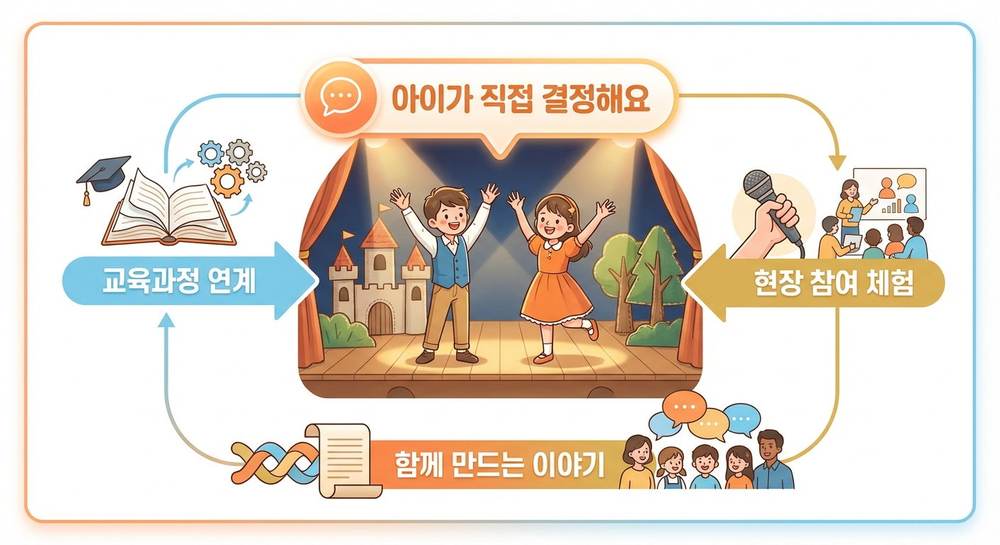

# 해와 달이 된 오누이 공연 안내

> 어린이 참여 뮤지컬 | 2026년 봄 시즌 | 서울 소극장

---

## 이 공연은 어떤 공연인가요?

"해와 달이 된 오누이"는 우리 모두가 기억하는 그 이야기를 무대 위에서 아이와 함께 다시 써 내려가는 특별한 경험입니다. 관객석의 아이들이 직접 손을 들어 선택하면, 그 선택이 무대의 조명과 이야기를 바꿉니다. 엄마 아빠가 어릴 때 마음속에 품었던 그 설렘이, 이제 아이의 두 눈 앞에서 살아 숨 쉬는 현장으로 펼쳐집니다.

---

## 이런 분들께 추천합니다

- 아이와 함께 특별한 추억을 만들고 싶은 부모님
- 교육과정과 연계된 문화 체험을 찾는 선생님
- 전래동화를 살아있는 이야기로 경험시키고 싶은 기관 담당자

---

## 관람 포인트

### 포인트 1: 아이가 직접 이야기를 결정해요

공연 중 두세 번, 이야기의 갈림길에서 관객이 투표합니다. 아이들이 손을 들어 선택하면 무대의 조명이 바뀌고, 오누이의 이야기가 달라집니다. 수동적으로 보는 것이 아니라 함께 만들어가는 이야기 — 우리 아이가 이야기의 주인공이 되는 순간입니다.

### 포인트 2: 교실에서는 절대 경험할 수 없는 빛과 소리의 세계

반투명 스크린 위에 펼쳐지는 그림자극과 황금빛 조명이 어우러져, OTT나 유튜브에서는 느낄 수 없는 현장만의 감각을 선사합니다. 호랑이의 등장과 함께 극장 전체에 울려 퍼지는 음향, 오누이가 하늘로 올라갈 때 쏟아지는 빛의 물결 — 이 순간은 극장 안에서만 경험할 수 있습니다.

### 포인트 3: 전래동화가 살아 숨 쉬는 현장 체험

국어 교과 전래문학 단원과 직접 연결되는 공연입니다. 교사·기관 담당자분들께는 사전 학습 자료, 교사용 지도서, 사후 워크시트를 무상으로 제공해 드립니다. 공연 관람이 교실 속 배움으로 자연스럽게 이어집니다.

---

## 주요 장면

### 설레는 시작 — 극장으로 가는 날

공연이 시작되기 전, 극장 로비에서부터 이야기는 시작됩니다. 아이들의 눈이 반짝이고, 손이 엄마 아빠의 손을 꼭 잡습니다. 처음 극장에 오는 어린이도, 두 번째 찾아오는 어린이도, 이 순간만큼은 모두가 설레는 주인공이 됩니다.

### 두근두근 위기 — 호랑이와의 만남

어머니를 잃은 오누이 앞에 호랑이가 나타납니다. 극적인 조명이 무대를 가르고, 긴장감이 극장을 가득 채웁니다. 이 순간 아이들은 숨을 멈추고 무대를 바라봅니다. "어떻게 해야 할까?" — 선택의 시간이 다가옵니다.

### 하늘을 향해 — 동아줄을 잡아라

관객들의 선택과 응원을 받으며, 오누이는 하늘에서 내려온 동아줄을 붙잡습니다. 황금빛이 쏟아지는 무대 위로 오누이가 올라가는 이 장면은, 공연 내내 가슴속에 남는 가장 빛나는 순간입니다. 아이들이 함께 만들어낸 용기의 결실입니다.

### 해와 달이 되다 — 빛나는 피날레

마침내 오누이가 해와 달로 변신합니다. 극장 전체를 황금빛과 은빛으로 물들이는 피날레 — 아이들의 박수가 터져 나오고, 부모님의 눈가에 따뜻한 것이 맺힙니다. 오래도록 기억될 특별한 하루의 마지막 장면입니다.

---

## 공연 정보

| 항목 | 내용 |
|------|------|
| 공연명 | 해와 달이 된 오누이 — "오누이야, 어떻게 할까?" |
| 장르 | 관객 참여형 어린이 뮤지컬 |
| 공연 기간 | 4주 (주 6회, 총 24회) |
| 러닝타임 | 70~80분 (인터미션 없는 단막) |
| 관람 연령 | 5세 이상 권장 (3~4세 보호자 동반 관람 가능) |
| 공연 장소 | 서울 소극장 (대학로 일원) |
| 공연 시간 | 평일 오전 10시 (단체 관람) / 주말 오전 11시, 오후 2시 (가족 관람) |
| 좌석 규모 | 120석 소극장 |
| 주연 | 홍길동 (오빠 역·바리톤), 김영희 (누이 역·소프라노) |

### 티켓 안내

| 구분 | 가격 |
|------|------|
| 성인 (보호자) | 25,000원 |
| 어린이 | 20,000원 |
| 단체 관람 (20인 이상) | 별도 문의 |
| 가족 패키지 (성인 1 + 어린이 1) | 별도 문의 |

---

## 단체 관람 안내 (유치원·학교·기관)

아이들이 배움과 즐거움을 함께 경험하는 단체 관람을 환영합니다.

**단체 관람 제공 혜택**

- 교육과정 연계 커리큘럼 자료 무상 제공 (교사용 지도서, 사전 학습 자료, 사후 워크시트)
- 초등 국어 교과 전래문학 단원 직접 매핑
- 단체 전용 좌석 사전 확보
- 안전한 소극장 환경 및 버스 접근성 우수

**단체 관람 문의**

단체 관람 예약은 공연 2~3개월 전에 미리 문의해 주시면 학기 초 연간 계획에 반영하실 수 있습니다.

---

## 예매 안내

온라인 예매: 인터파크 티켓 / YES24 티켓

- 얼리버드 할인: 공연 2개월 전 예매 시 특별 할인 혜택 제공
- 가족 패키지: 성인 1 + 어린이 1 묶음 구성 (별도 문의)
- 단체 관람 (20인 이상) 별도 문의

**문의처**

TPM 공연기획 | 단체 관람 및 교육 패키지 문의

---

*"우리 아이에게 처음 들려주는 하늘 이야기 — 오누이야, 어떻게 할까?"*

*해와 달이 된 오누이 | 2026년 봄 시즌 | TPM 제작*

---

